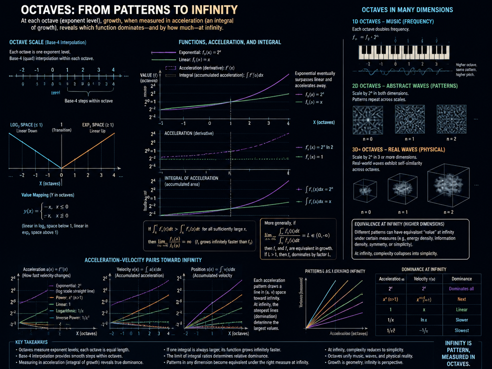
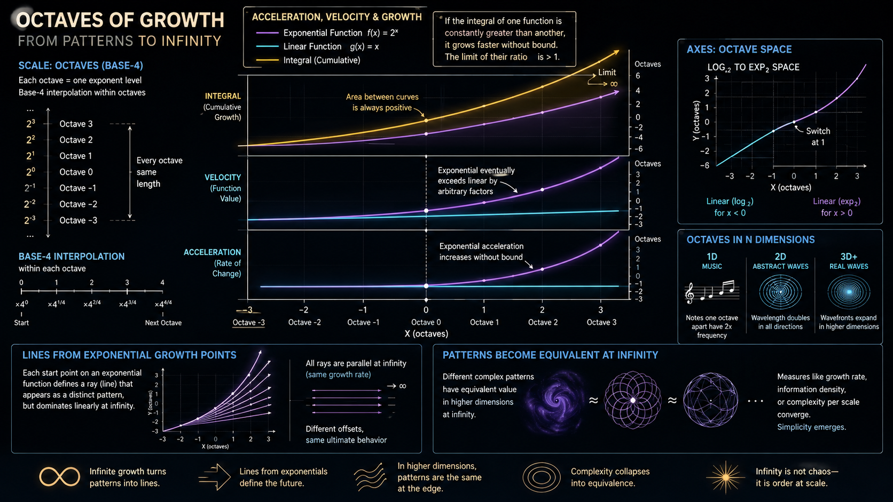
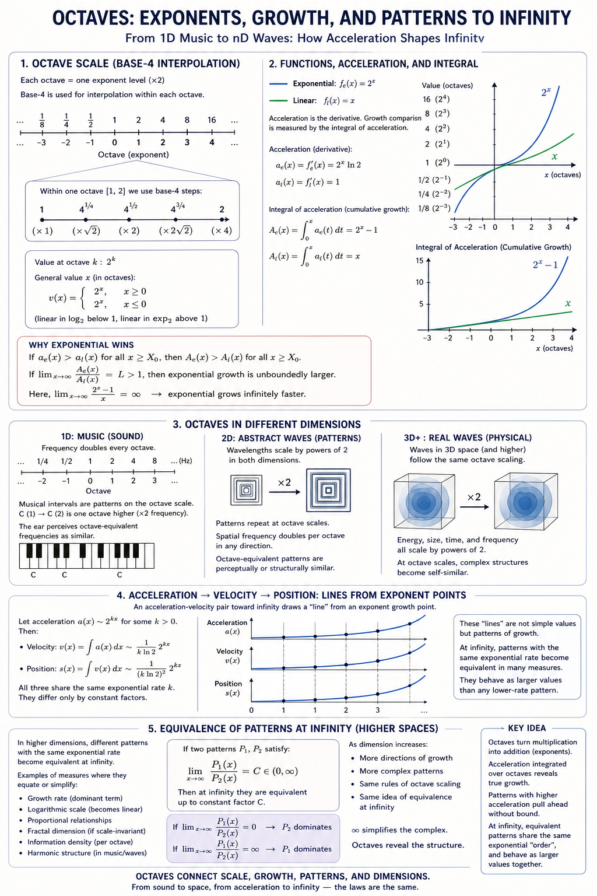

# Log, lin, exp

Change one point at any:

Z, Log, differential 1, Octave -1:
- Change one point value for a moment, you create *momentum towards it*, an impulse of physical acceleration.

Lin, differential 0 / integral 0, Octave 0:
- Change one point, and you have changed one point.

Exp, integral 1, Octave 1:
- Change one point, and it keeps accelerating whole infinity, so the diagonal line adds it 1/2 of infinitesimal; future-symmetric relation adds 1/4 tesimals, both-directional symmetric change adds 1/2 which also outbalances itself if done at zero point.

In each case, let's just draw some, the whole point of this:

 

 

