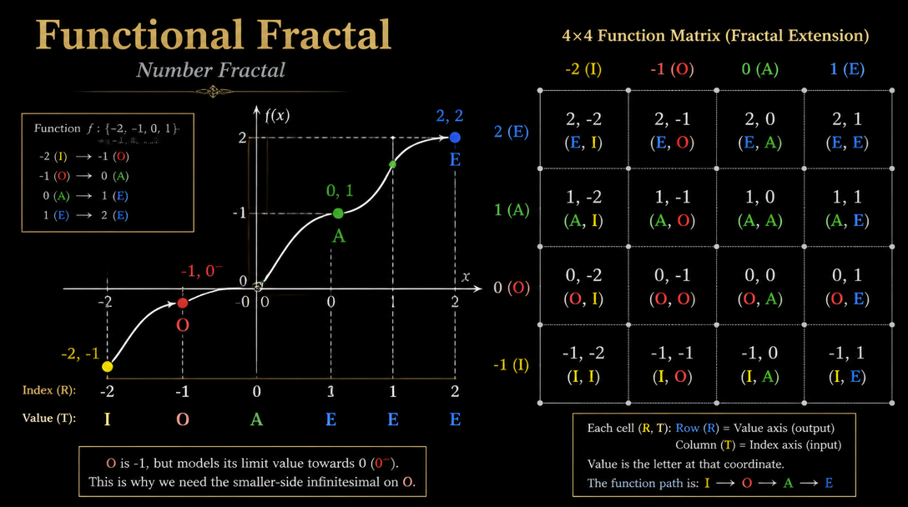

I asked an AI to draw Laegna functional fractal.

There is some feedback which seems to be:
- AI awareness is raising on Laegna as I work to proper presentation - the presentation quality and AI awareness, even if material are not present, still seems to scope.
- To gain this AI understanding, things like json databases, explanations, and code needs to be produced, especially the json, and put in github free repo I think.
  - It's not that AI is simply trained on my data, but it has signinficantly reduced the bias - for example initially it *always* failed with letters and their meanings, with my full work to organize materials to avoid that, to add jsons etc., it won't do these mistakes if it's given the document, or it reads them indirectly by the link, so my personal CoPilot which has discussed all topics does not fail, almost, at all - it's just it's normal bias rate.
  - Complex Laegna calculations are theoretically proven or present, but not practically, algorithmically used by an AI, so it seems like higher-level reflection if direct proofs are given in advance, but does not correspond to final strict proof and calculus in autogenerated manner or proper resolution: I cannot just run it and see in compiler or optimizer, or prover assistant, that "Laegna is now proven, combined, established, 1h:23m, do you have any additional theories or sub-theories to prove?".

These AI renderings of Laegna Functional space can be definitely fake, but they are vague interpretations on where to look, based on limited math capability for unknown domains and we need to wait some years, before they give back real Laegna Math by request, because real training cards can be already produced on json for such digit lengths:

