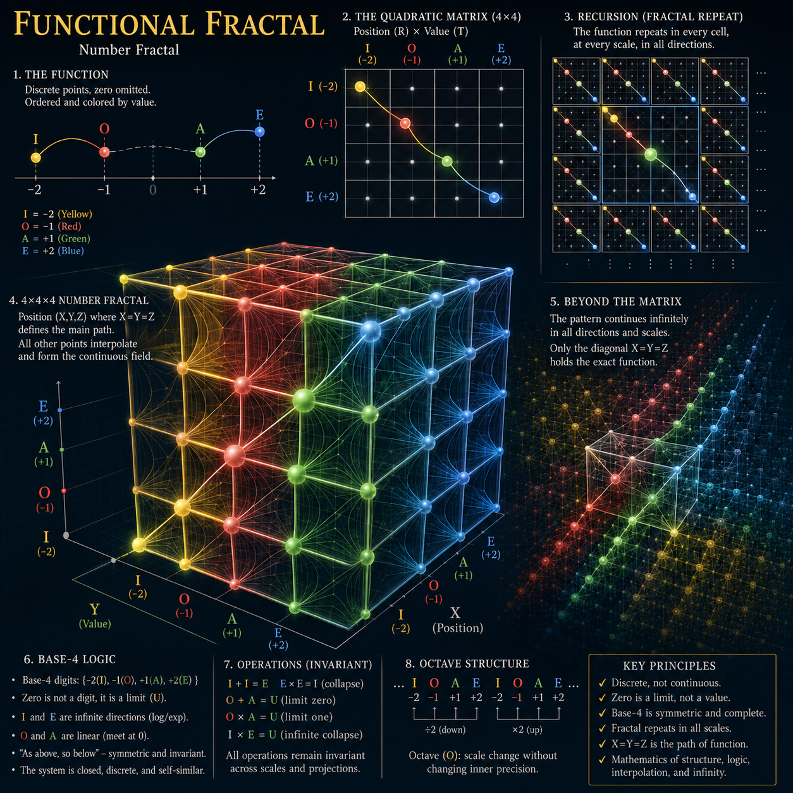
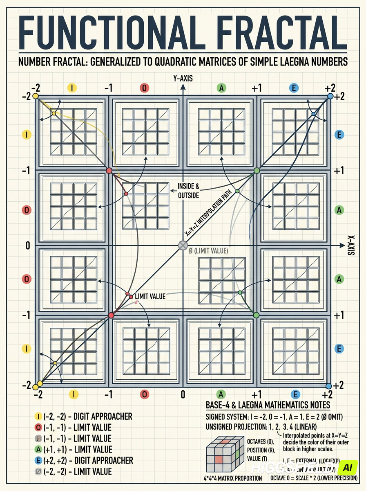
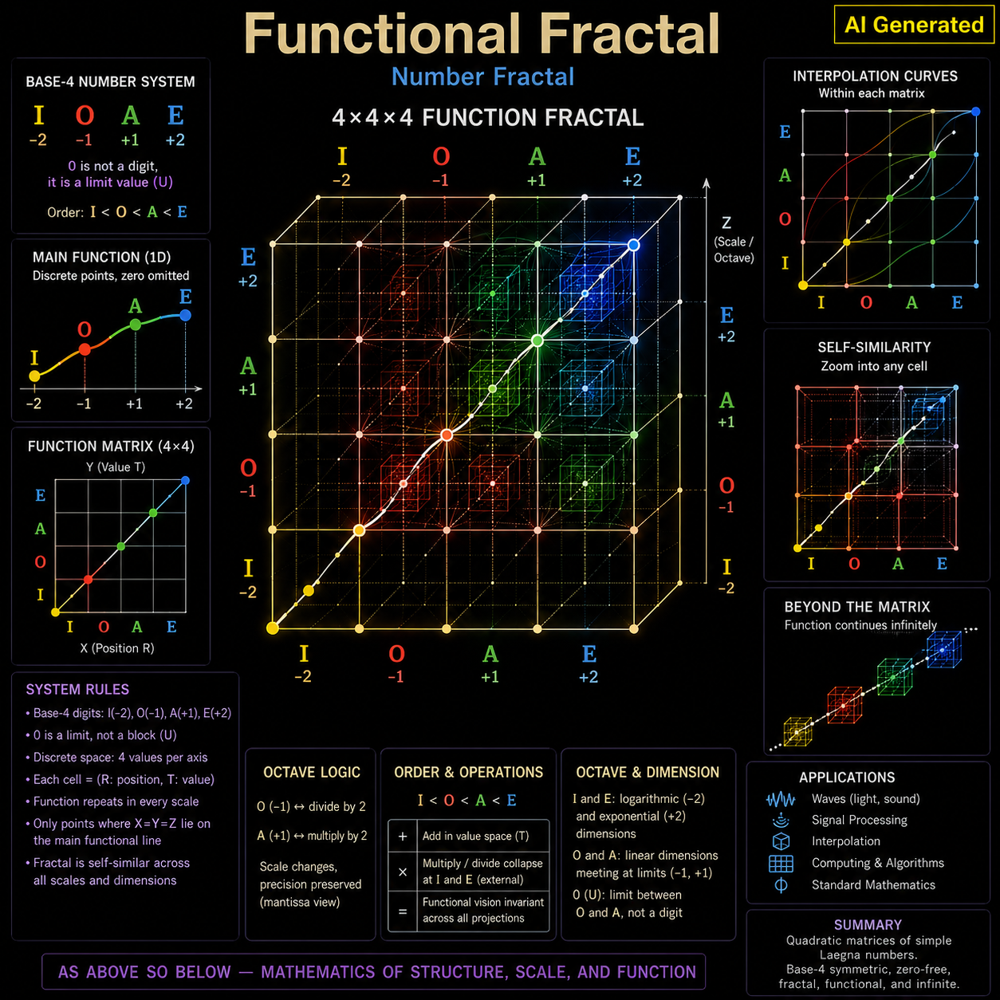
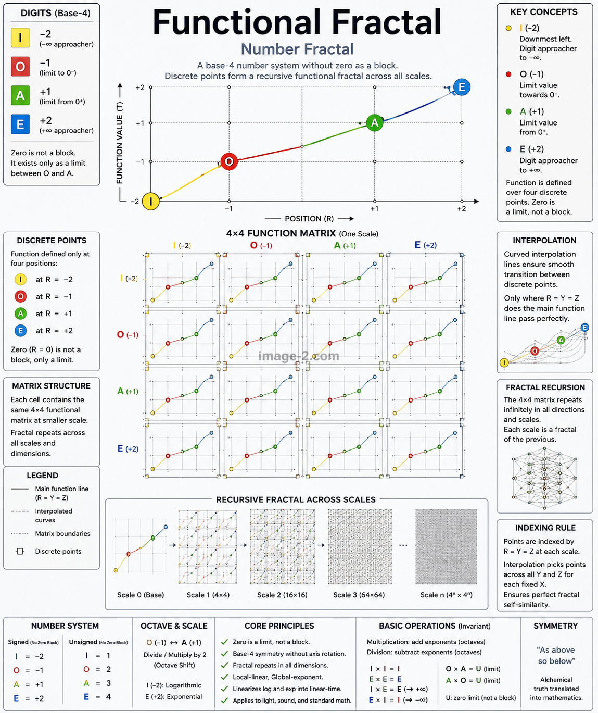
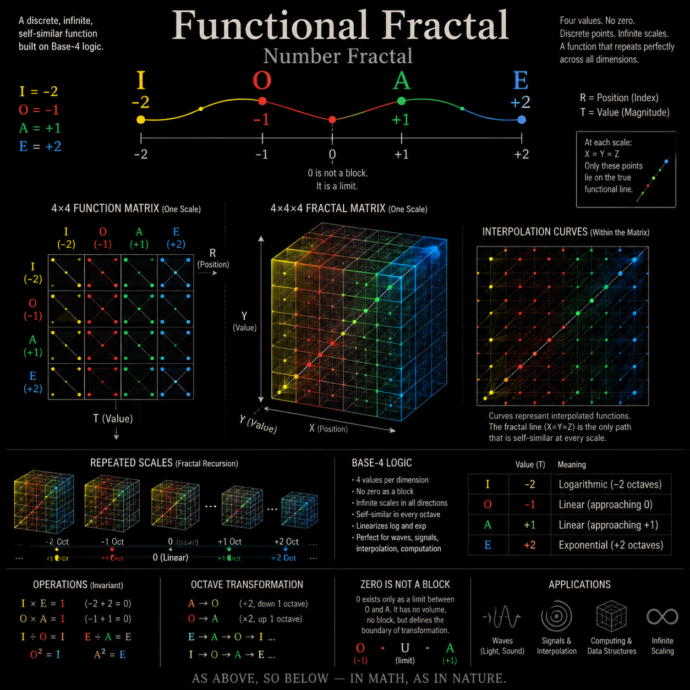
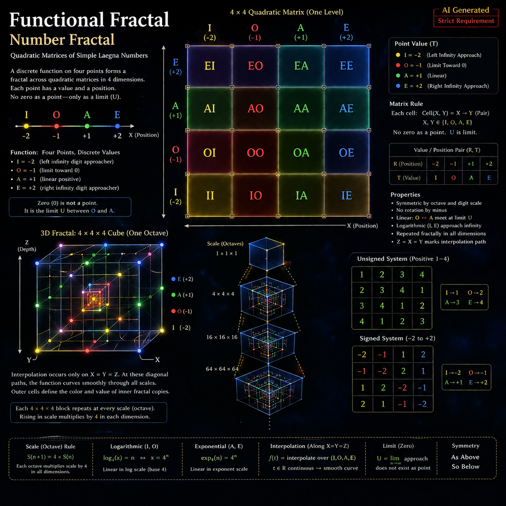

I asked an AI to draw Laegna functional fractal.

There is some feedback which seems to be:
- AI awareness is raising on Laegna as I work to proper presentation - the presentation quality and AI awareness, even if material are not present, still seems to scope.
- To gain this AI understanding, things like json databases, explanations, and code needs to be produced, especially the json, and put in github free repo I think.
  - It's not that AI is simply trained on my data, but it has signinficantly reduced the bias - for example initially it *always* failed with letters and their meanings, with my full work to organize materials to avoid that, to add jsons etc., it won't do these mistakes if it's given the document, or it reads them indirectly by the link, so my personal CoPilot which has discussed all topics does not fail, almost, at all - it's just it's normal bias rate.
  - Complex Laegna calculations are theoretically proven or present, but not practically, algorithmically used by an AI, so it seems like higher-level reflection if direct proofs are given in advance, but does not correspond to final strict proof and calculus in autogenerated manner or proper resolution: I cannot just run it and see in compiler or optimizer, or prover assistant, that "Laegna is now proven, combined, established, 1h:23m, do you have any additional theories or sub-theories to prove?".

# Functional Fractal

These AI renderings of Laegna Functional space can be definitely fake, but they are vague interpretations on where to look, based on limited math capability for unknown domains and we need to wait some years, before they give back real Laegna Math by request, because real training cards can be already produced on json for such digit lengths:

## Functional Fractal

Now the results have got a little better. Notice the instruction projects with aid of Hilbert's math, running it into my geometrized system - AI might be capable of understanding, which views are needed to present such numeric fractal, and how the standard functions actually pass the smoothening - but some Laegna-specific details are left untitled, unset, naturally present in the structure and organization itself: I project Hilbert's spaces to angles, where he projects them to classes and instances, to oversimplify things:

## Functional Fractal 1

This AI, given the same task, rather wanted to present the actual dynamics of inner and outer scales - This is exponent reduced to it's band value, semantic meaning of "inner" and "outer" present in how "IE" and "OA" scale-variants can be actually present, if they represent the actual wave curvature (a "fractal hologram", as I am used to call this representation method):

## Functional Fractal 2

## Functional Fractal 3

We continue with same task until AIs, drawing specific aspects or details mentioned, yet cover enough of them to *abstract imagination* of basic properties of lanes - where I need to start the abstract; what is the actual thing you should see in your mental eye, but the modern AI yet still blurs out and simplifies a lot, altough functions are good enough if they "look like" these functions - many factual textbooks do not give much more than their hand-drawings, and topology of interest points is more interesting than specific, angle-exact curvature, which might be just a random paradox for higher-space functions, such as *actual* drawing of the acceleration curve, which actually occurs *symmetric to curved space*, and is just linear enough to esimate it on paper - one cannot make a machine, which invariably draws the same relations, and remains invariant accross scales without generalization, specification, and signature points such as we have -1, 0, 1 at each octave; this AI was capable for fractal - by plain eye, it's topologically closest to real fractal line, and fractal axis are visible well enough and associated to right quadratics under reprojections / transcensals - such as E, E literally represented in blue, which is similar transcend to previous image (O and A, I and E literally showing the local-global axis, rather than their combined value):

## Functional Fractal 4

Same task now gave the best presentation about the logic, how Zero is removed from number scale (discrete-continuous invariant) - as you can see, previous generations included this as *text*, but this AI chose it as main element so my description is not yet purged; altough it should generate one large image with all details, rather than "random zoomin picks", but well *this happens in the future with even the same AIs if they survive the competitive market*:

## Functional Fractal 5

This AI also generated Functional Fractal 3, and the task is still unmodified:

## Functional Fractal 6

Cells (left to right) and values (bottom to top) properly enumerated in laegna base-4 RT scale, R and T from I to O; interesting fractal hologram effects:

