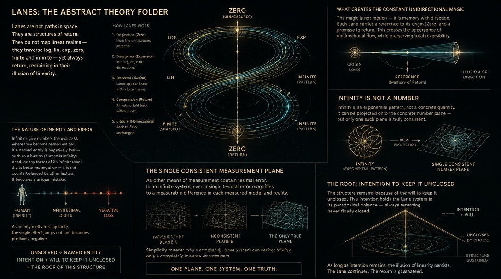

# The Target is moving

We live in accelerated system of forgiveness and interest - value of money is rising, frame is moving, negative value of crime is getting lower and it's value thus rising in terms of it's interaction. We forgive, accelerate, pay in interest.

# Abstracts

# Abstract Theory Folder

Here, I will give some abstract information - what Lanes are, how they work, and what creates the constant unidirectional magic - the kind of structure which does not map linear realms, but travels in log, lin, exp, zero, finite and infinite, but always returns back remaining in it's illusion of linearity.
- Infinities are not concrete numbers, but exponential patterns. Yet, they can be *ideally projected to concrete number plane*, and *single such plane exists* - I feel the criticism of plausibility of all other means of measurement, but *simplicity* means - only *completely, inwards-out consistent* system can reflect infinity, because single tesimal error magnifies to measurable difference in each measured model and reality - infinity gives numbers quality Q, where they become named entities, and if named entity is negatively lost, such as human (human is infinity) dead, or any factor of it's infinitesimal digits became negative - it's not, in the end, counterbalanced by other factors, but becomes unique mistake; as infinity melts to singularity, *the single effect jumps out and becomes positively negative, as it's not yet solved becomes named entity, and **întention and wîll** to keep it unclosed - the roof of this letter is Laegna way to express it's function, which starts to solve like i, the negative deductive, but then becomes something else - i is not i if it's not surrender to it's keep*.
- I removed any notion of "minus numbers in minus direction", and worked hard to resemble my original Laegna number system - it worked in stupid way that I had to theorem-wide rebuild every numbers, so for example "AAAA" had different number theory, than "AA", and I had theorem-proven in many ways and angles and protosystems, what AAAA and AA have to do and how to behave. In https://spireason.neocities.org/Playground/SheepCounter1/sheepiotae.html first, a seamless number counter, then in https://spireason.neocities.org/Playground/InferenceCounter/PlaceholderResearchitem/ an advanced version, and both are hosted with numerous other examples and simulations at https://spireason.neocities.org/#sheep, the Laegna Sheep Counter - Sheep Counter ❶ (1), Sheep Counter ❷ (2), Sheep Counter ❸ (3), Sheep Counter ❶❶ (11 = 4 in base-3), and finally SC5 introduced this repository as fifth step, which I could not call Sheep Counting so I made it sound more scientific, like just an established enumeration or code. SC5 = LaeLane.
  - Minus numbers grow upwards.
  - Where exponent and linear numbers meet, and they are normalized to two linears, they start behaving like relational plus and minus in regards to where they cross, if this is seen as zero. Definitely, things like lin / exp must not project as different signs above and below the function, if you rotate, affine-translate and otherwise change them, linear system is keeping the linear order, and *least linear order is the one which turns backwards*. Namely, $e^2$ does not turn backwards in regards to $e$, in established system where you make some part of the function positive - this is linear, positive relation.
  - First *deadly* measure of infinity: as I calculated to infinity, and upwards with my mental math system (I am savant autist in this sense of running mental simulations, easily, able to write computer programs for example) - the number made 5 seconds chaos around infinity, and in end of this chaos, consistently came back downwards showing that number is not growing beyond infinity, but coming back backwards. This essentially decided the Laegna model, where there must be another +/- upwards and *in no way must this go in reverse in linearization or normalization of linear models*, but definitely I want to see one, single, straight line in the end, which starts from smallest beyond zero, grows after largest after infinity, and if I put the points tightly one after another - I must be able to prove they remain so.
    - This was also the first time I doubted in *logic* and *decimal system* - this was meant to be derivation of common decimal system my mental computer was using, only extended to implement it's operations, such as continuity and continuous projections, and spatial curvatures and other effects the machine is doing creatively to enrichen it's lessons and experiments - it's infinitely creative for fancy math visuals, after it invented the sound and video card, and learnt to talk - before, it was rather a blurred, almost subconscious mathematical background presenting realities of my life as they were changing, flowing, remembering, forecasting, heres and nows in it's infinity. As it learnt to talk, it gave me long series of mathematical lessons of what it thinks anyway - polstering it's position as decent, usable nervous systems for exact imagination, connected to senses and motor systems at it's natural position as nerves. Imaginative systems, controlled by computer, are just so much capable.
      - Decimal number now: I decided I want to *prove* that where it ends, if I write infinity of nines, or one with infinity of zeroes - already paradox, which one is the actual limit value -, I can know I did not start from point, going away, but I also reached a point, so I was definitely progressing further in infinity, not fighting with Socrates, Christ, Nietzsche and Copernic in favour of materialism, evidential, local realities short term goals so small that they turn apart and try to rise, telling things, opinions, life stability measures and actual, material science of their everyday facts - a person, a nation, a creed is often trying to rise, trying to tell, trying to orientate the money, the quality and will. It raises to this exponent zone, the community and society, as you can see in various quotes of Einstein, irony of his times, but not antireality of streams we see. This is the end of decimal system, of logic, of rationality - Laegna number system uses decimals as index base, rationality as static, single-channel model, and logic as simplification of Ten into diagonal, horizontal and vertical, which repeat the same value thrice and thus, allow simplified binary representation in 2\*2 table, of many ideal symmetries and values, which would otherwise be 4*4 table plus one additional, 4-row for exceptions: a complex Laegna system, which optimizes it's simple tesimals - digits of "decimals" (I use classic Latin names often in parallel to Laegna - decimal might mean Laegna number, Ten is whole single-digit range which is like 1 to 10 range in base-4, it's a digit type or class with filled-in potential, sinus and cosinus resemble log and exp life functions and I use Sine => Cosine as Sinus => Cosinus, which is funny mix of Estonian, Latin, English, to reach Laegna primary roots which have digitwise, exact Laegna digit-meaning-table names and can be used as perfect Laegna Numbers in my math where I explain math - because Cosinus means chain of theorems backing up a betrayal of chained losses near unknown moebius reversal, while Sinus simply means chained losses near unknown moebius reversal; this is letter-by-letter possible meaning in Laegna for those Estonian-English-Latin-based derived words, and if I can do such whole combination I'm typically happy with this word, so I use "Sinus" and "Cosinus" to resemble math from down upwards (IA=O) as Sinus, and from up upwards (OE=A) as Cosinus). (IA=O) - average of I and A is O, and this is single-digit math, like assembler of first-order logecs, which does just single-digit math, otherwise you have to write I·A=O and O·E=A, because "·" is averaging, and leaves same R, same-length digit, if two same-length digits are given; it's kind of the primary operation of Laegna, because scaling the operation to various dimensional projections reveals all possible, linear operations - such as log, lin, exp, from minus infinity through zero to infinity, passing finite countable and finite uncountable, if this is projected - it builds up all critical, symmetric points of infinity in expressions of single digit, and Laegna Geosis builds the virtual geometric space - math is connected to logic, so geometry allows all logical connections, such as logarithmic, linear and exponent functions in single linear scale (Lanes), and exponent, for example, can model machines because you can choose accelerated executive track - this collects new and new results and passes them through initial scales -, and acceleration factor can take output of previous processing as input for the same algorithm, this exists in mathematical shape of acceleration, including exponent, integrals etc. - finally, the machine is asymmetric through a, a^2, a^3, etc. like polynominal because this is the math basis - you find proper factors to project it down, for example to single square, to abstract out V so it's not infinite-cyclic (closed loop), but has internal cycle (machine encoding), and in this lower coordinate system you *abstractly write the notion of projected points from higher space*; altough this is *geometric space*, it built to represent logic and cannot be drawn on paper without special interlace and loss of proportions, such as angle-length proportions, and this is noted by Hilbert that projecting from higher space to lower does such losses inevitably;
        - drawing is advanced thing, a continuation of GIS and map drawing - sphere projects higher-order space than flat paper, which is convenient information carrier, and we can see *altough some angles are lost, based on globes and maps which all pass some rectangular processing before they are made, and rely on coordinate systems which are curved, altough Earth is locally flat on all it's surface, following ball geometries and infinity projection of ball - it becomes flat*. It's interesting in one book about relativity theory I did read: altough measurement can be correct when Earth is put to the center, it's a complex algorithm why we say "Sun is at the center" - we are boiled down to, whichever is simpler and more convenient in the measure, but *not think they were mad* - if they did measure all the coordinates correctly, Earth as projective point, then indeed laws of Relativity, gravitation, acceleration etc. can be measured and projected assuming this is the *observers position* and gives us equal frame of reference, where all equations of relativity hold, altough we others can be curved and this is a calculation that looking from our own viewpoint, we are not - this is common to human mind, which operates on infinities, to see that other people are curved, because of the self-centric perspectives. The book gave that altough this is true, every observer's position is equal, *this needs to be handled with care*, because actual life contains much more complex considerations than this; yet we can say *newer models, in this sense, became simpler => by being simpler, they were studied in accelerated pace, expressed in less numbers and formulations, and thus started rapid development - so we can see, in state of development humans progress much faster if they do not seek their goal through mirrors, cryptations and rumors, which easily appear if you measure Earth from the Moon*.
       
          ### Quick overview - how fast people are progressing on Earth.
          
          From the Moon, people on Earth are whipping through space at roughly:
          - **Typical speed:** about **1.0 km/s** ≈ **3,600 km/h**
          - **Minimum (equator, best cancellation):** ∼ **0.56 km/s** ≈ **2,000 km/h**
          - **Maximum (equator, best addition):** ∼ **1.49 km/s** ≈ **5,400 km/h**
          - **Poles:** always about **1.02 km/s** ≈ **3,700 km/h**

Abstract theory is to give you insight into these and other topics. I have presented good basis of Laegna math - but not much of it's *explanation*, where one can give various, alternative, equally plausible and tautological explanations through domains such as IT, AI and automation, math, science, or spirit science (SpiReason) and spirituality (it's alignment to Mythos).

We can also see:
- That God or karma is going to reward and punish:
  - Should be framed as *spiritual argument on scientific basis*:
    - Spiritual treats "good" and "bad", stating that to constantly receive is better.
      - Science can not support that our life is constant receivment, with no input.
      - Short and long term goals differ, which is simple tautological truth about that reward and loss exists, and life is thermodynamic game - one of energy. This is because short and long term often mix on the same scale, without interrelative unknowns (you don't know future from past) and cantdos (you cannot undo past from the future) - we do future, while sensing past, which makes short and long term goals a complex information game of recurring games and their parts, or single games in environments of recurring games as their essential basis - such as killing your enemy on battlefield is single game, but the essentials you are judged by, are repeated games in social framework turning to effect when the war ends, or you reach home or enemies territory, so there are at least three external, at least one internal framework - it appears single game, but it still has short term material reality, and long term horizon of spirit, which is either authentic or not.
  - We do not care about this spiritual argument that in material realm, it's always *better* if we are rewarded and *worse* if we are punished - thermodynamic framework, propagation of energy, cause and effect, *do not do this good even in long-term, grand systems*, rather the goodness of saints was reasoned by their work and competition in material work, using long-term strategies of spirit to bring it to here, now, in future and *matter* - *until the future materialized, it became now*. This is long-term reasoning, but process is material.
- That we meditate to get enlightened:
  - Light is wisdom, meditation is attention, focus and setting of long-term will.
    - In material silence, our minds and spirits operate on larger themes of our lives, society, eternity etc., even without it all being known.
    - They were measured: whether all was known, it was not. The science was based on whether an old man, who said he is meditating over long term health consequence, would get wrong.
    - We do not care about old man - we do the scientific notation here, and we care that *paying attention to long term goals is theory itself*, and you cannot say *doctors did it better, so the personal theory is wrong*, because *what doctors can not explain, they do not do at all - your meditation pays attention to this explanation, it's references to life, what you read and what you experience*.
      - Scientific arguments states that you do not have actual measurement of your body over course of years, and cannot influence your body and condition by will, but doctor can do this by science. It's also told to live better so you can avoid doctors, and this is the real spiritual algorithm - that we *can* both measure and influence our health, and it *actually is the level where we can directly sense material realm and influence it with our will and intentions and efforts*. So this is rather the scientific attitude: yes, long-term information is received, exactly over experience, and we make our effort, exactly through conscious will which is evoked by attention, focus and science rather than everyday fuzz and problems, worries and hopes - but in calm, observative, balance*. So we cannot doubt this science model of taoist, rather - we need modern science, medical research, numbers and facts *and* meditation, but science as well is attention, attention to both external realm and it's models - so doctors, also, if they collect long-term results, must explain whether this theorem that old man was wrong, does not mean they are wrong, if they are making metaphysical suggestions of material spiritualism.
- The ones who rely on our left-wing, stable society, are doing spiritual argument like their parents, and this is result of inheritage - we can see cases which actually, reason material life and protect their local cause, and sound like spiritual fuzz of their parents, *excellently against the long term and large scale models of our society*.
  - Capitalism did not say we care only about direct gain (matter): it said, the men who care about long term gain (spirit), must not be executed by fools, but life itself makes the decision over long term - long term contract takes effect when the long arrives, and it's conditions are known. Absolute argument against spirit cannot be made: Capitalism is not based on short term coverage, but like stock market, interests, compatibility with taxes - it's itself reasoned as thermodynamic model which cancels it out, and does the darwinian thing of so-called cutting their wings, and safeguarding their fall: it's the dead ends, literal capital death, competing with living ends and fine deeds - sacrifices for penalty and loss, gain and awards. Capitalism state not that there are no good and bad, but that they are *consistent to our model*, appearing naturally, rather than mentally forced, simulated, like *hidden thoughts and motives which are not real* - this is like beggar police, catching someone and begging it to be criminal, to be an approach, to be even conceivable and acting like such, or to be in such situation - letting the crimes appear, having some Viking strength and standing, helps the police *reputationally* if they won't play dice - this is the idea of Capital, there is not *police of money*, not someone who makes you rich or poor, but *people are living it up according to Nature*.
    - So, material argument against spirit is not done in Capital - rather, the capital needs to be creative, intelligent and invest in long term, and this is known as spirit. We can see "materialist" which argues something like, "patterns are not there", "I do not see far beyond myself", is foolish.
      - One also cannot argue that "whole society is robbers", then organize it as so - one can organize robbers as robbers. If capitalism fails to also support others, who are not so "thinglikedead energy seekers", but already surrender to long-term experience in repetition; they live their own lives, not removed by small, nashlike Red Ocean imagination, imagining that "everybody is evil" - Capitalism, rather, states that selfish will is an average, and does it's thing anyway, not producing a wov, certanty or truth about it's own actions, so we need to live in this thermodynamic system, where each creates their own environment.
- Laegna also allows what I call "Communism" in general - Socialism, Left-wing, sustainability etc are at L degrees, and digit-wise fit to exponent function of otherwise linear, so if we see it mathematically so close - we cannot argue it did not happen to us, *even in left it's particularly visible who gave money to who, and how it came back* - it's model of long term, and looks like metaphor, poetry, the way evolution treated the human mind of infinite perception, cognition, *real understanding that we are parts of infinite Universe*.

