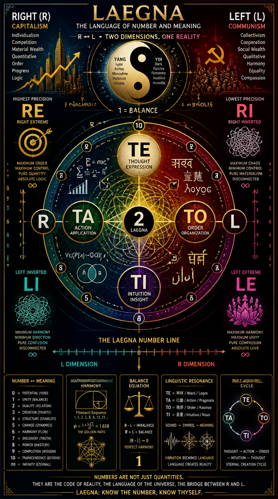
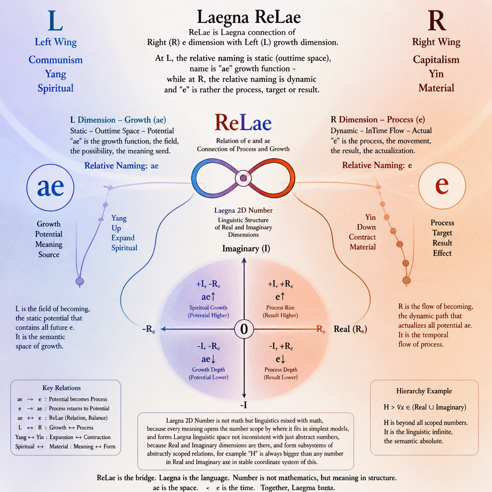

# Laegna ReLae

Relae is Laegna connection of Right (R) e dimension with Left (L) growth dimension. At L, the relative naming is *static* (outtime space), name is "ae" growth function - while at R, the relative naming is dynamic and "e" is rather the process, target or result.
- R is Right Wing, Capitalism, Yin, Material.
- L is Left Wing, Communism, Yang, Spiritual.

Consider Laegna 2D number:

```
Letter order:
- TE (highest precision, such as first E at RE line), TA, TO, TI (lowest precision, such as "A" at RO line).

RE: EAEE
RA: AAOE
RO: OOOA
RI: IIAE
```

## Not math but linguistics mixed with math - because every meaning opens the number scope by *where it fits in simplest models*, and forms Laegna linguistic space not inconsistent with just abstract numbers, because Real and Imaginary dimensions are there, and form subsystems of abstractly scoped relations, for example "H" is always bigger than any number in Real and Imaginary axe in stable coordinate system of this scope, and it contains limit values of both so it's "mean", order, higher direction and final value recurring-approaching:

The following *linguistic connection* is relative to your models, but gives you estimations of scopes of each position so that you can read the Laegna 2D number, where R=Hex (positions are hex digits, of laegna base-16) and T=Lae (values are lae digits, of laegna std. base-4).

E frequency ***RE***; whole this is one single number, it's function appears when looking at highest windows of frequency measure; this is 4-digit totality code, the round direction at highest view:
- Number starts high, has one drawback, then remains accelerating upwards. "H" at position of the last "E" is the height, the last and final mean value or ideal measure;
  - The letter positions at E read: GFEH, which means gravity (E), frequency (A), first-order infinity (E), infinity squared or mean value, the last and eternal (E).

A frequency ***RA***; this is two numbers AA and OE, because at octave down, now the eternity is - 2-digit initiation code, 2-digit culmination code:
- Number starts at position, which is it's initiation AA (does this in past - just living in OK condition, not taking effort nor culminating in life/organization/civilization victories), then takes effort O and suceeds finally in E (repeats doing this acceleratively to infinity):
  - Positions hex-16 CBAD read: C and B are C: ordered values like pearls, like letters in text etc., B: working, becoming, approaching. AA has ordered life at normal position, working stably. AD are A: Position, stable reference system and stable value or "trueness"; D - approaching a dimension, which slowly starts to constitute reality, but never visibly approaches anything "final"; like framing something constantly as something, but never letting it be - it has yet many effects of this something in unnoticeable, passing, resembling, so it *very deeply* constitutes this thing; this could be hidden hate or love - strong, never visible, but creating some virtual effects of it's reality sometimes, and often almost unnoticeably, often meant so. OE thus means, in future the Position, rooting tends to be O, work, while the dimension which is constantly framed is success - the final success is never there, but in this work, it often seems to appear, such as having elements of success - occasionally better chocolate where others have none, a nice vacation or occasional, unexpected smile - small things which resemble success, but they are not it in plain pure form where you take successful amount of money from bank, are are VIP for government, married to literal part-time supermodel who also made a scientific discovery and gained ordens in important war, at absolutely critical position - well one of these factors is success, but with hard working all the time, one can have just *occasional* signs of success, such as just *happens* to be in 8-person boat where they personally helped everybody - it's like a moment of life of fame, but then it might happen years later; it's like wearing suit at marriage and going to cementry - you can say you weared suit at every important event, but it doesn't sound like *final truth about of your life itself*, rather it sounds like something you got, relatively cheaply, almost unnoticeably, but relatively close - because others, might mean 2000 events if they say "most important in my life", but they weared suits just at 90% of them - so what is relative exponent or absolute linear measure, crosses like Moebius and order depends on zoom, either global (100% is more) or local (1800 times is more).
 
A frequency *RO*; here, on negative fractal it's divided to two:
- Two, but lower linear scale, negative division: instead of dividing to scope, where pattern of 2 is two times larger than it's part (*RA*), this is dividing in range, where pattern 2 is needed two times for whole, and *RA* as two wholes of itself thus contains it 4 times.
  - QPOR - OOOA now positionally code that in each unit, the material pattern is initially O, bound to get O much of little damage, and the jump occurs (P => A) at O, so the next is that it jumps out of O value; progression is rather local and at end of every work, with this initial quality and jump, OR is achieved - O is deductive, basis, and R is the final infinity which is yet in linear realm - H is already in graph-like realm. R is also the right: if deductive is O, deductive itself, and infinity is position, each work ends at it's mean value.
 
A frequency *RI*; here, negative fractal divides each *RO* into subsequent 2 with progression of 2, or the 1 unit into downwards division to four, where the previous symmetry just follows in repetition of dispositions of numbers:
- This is negatively infinite - atomic frequency under your clock, which infinitely repeats.
  - KJIL: IIAE - K is one divided by infinity squared, and infinity of K units is one unit I, so it's subparticle, a smallest, final division in smooth realm - exact opposite of H, /H (empty number, potential, divided by H - here, 1/H, H with division sign, operation on higher exponent channel of two channels of both axes, four bits in total in one hex-16 number). J is two smallest units, "AND". If it's smallest frequency, and it's "two units", both are I - I is relatively fine *size* for them, because infinitesimal is then approximately infinitesimal - what is supposed to be small, is small. IL - the unit I itself, or the introverted, local, and L - infinity of them is *magnificand of infinity*, because it shows smallest unit - one which moves locally by one at every point if infinity is moven by one in global, and that's exp-log meaning - exponent or logarithm operate, in every meaningful projection, very close to I, such as I/4, I/2, or I (log +1 at point will do 1/4 +1 operations on infinity, thus 1/4 on every tesimal on average, thus if this is your unit, I/4 is *Left* - but I has limit value on imaginary axe towards L, and if it operates on precision of containing infinity range of values - L (imaginary - 2, infinity; real - -2) and I (imaginary - 1, unit; real - -2, infinitely small or negative, which project to same repeated logic in Laegna - logic of precision, negative divisions for all ops); finally we can see - L must project exactly, that it's infinity of imaginary scale, projects standard numbers in infinitesimal scale, and thus: top row projects to bottom row, top row is infinity in 4-digit number, and this is L, while bottom row is each unit divided by 4, which is R - or otherwise, A line (CBAD) might be R, projecting to gain rather than complete range (this is sometimes difference of signed and unsigned representation).
 
Single four-digit numbers compresses this:

Let's say `OAOA`.

On four lines, it looks like:
```
RE: OAOA
RA: OAOA
RO: OAOA
RI: OAOA
```

This is in laegna, fractal continuation of digits to infinity, where down and up the number is repeated to aligned dimensions to keep it's value as-is, because for example, if zeroes are there, angle would approach zero as you add lines: now, it remains constant. New lines, altough, can have specific value, or leave it open for existing pattern to go on so that value, basically, remains same where spatiality rises - this space has 2 octaves higher spatiality in total (4 lines, 4 digits) than 4 digits itself - 16 * 4 * 2 * 2, 4 => 8 => 16 is how octaves grow. This is ideal Fourier distribution in Laegna, holding either for one octave in 4 bands, with 4 windows (RI has window size 1, RE has window size 4).
- Spirituality: RE is highest frequency, because unit 1 sinusoid in single infinity becomes divided - four times larger infinity is particularly, actually, *four times more dense infinity*, because it's limits won't change. So 1 splits to 4 parts, and 0.25-length sine wave repeated is *higher*. RI, subsequently, lives only 1/4 sine waves at infinity, thus having smaller frequency - if it remains static linearly, and infinity is multiplied by (R)E, there would be one wave, but in normal operations it can often remain in 1/4 relation to changing infinity, because I is rather logarithm (sensitive to exponential growth) than linear (sensitive to linear growth), so it would be more sensitive to operation which *grows beyond infinity* in some settings of operational-scalar or dimensional relations which I often use - because a thing, in infinity, just earns a static amount and it's history is over, such as stone age - the literal stone age won't get much longer, altough it's problem-distribution has every problem present here and now somewhat - so we can also measure that if occasionally, stone-age-like exact events happen, it continues, but if it's literally over, it's length would not grow any more which is meaning of this interpretation - lowest line is particulars. Repetition of lowest line is still stable-length, or it grows in square root speed of approaching.

This type of simplified models are very easy to calculate, and the linguistic extension to math - it might not be precise in every model of yours, but to translate the number properties to something meaningful, at least is a mnemonic act, and also an establishment of symbolic system, which can be literal model measure - but not becoming illogical as you extend it's terms by logical-mathematical rules, frequencies, waves and harmonies.

# Conclusion

Notice the following image uses linguistic patterns of letters, rather than mathematical - for example, "ae" rather than seen as upwards number, is linguistically extended: either you go upwards ae, or reverse-outof ae, and this kind of views are pure linguistic: numbers become entities, entities become linguistically processed - Laegna number is core of it's language, and it's language is poetic-semantical user for the numbers, able to scope them to fantasy, science and life: so the rules get *heavily extended*. This is why the other, SpiReason's pages call you to be poetic and irrational - this conclusion, as well, is about depth of life in Laegna numbers, and needs to be built on semantic association if you use it - towards life, not keeping it as strict, ordered, simple, natural numbers - rather, add arrows, extensions, scopes and see how *same number is different at position and negation* - an easy way to bring it back to math, because in math, -AE is AE counted up from -II, to -EE which is -1 in X or it's limit -0 in continuous mode Z, and so the math backs up this use of Language as it's holistic view to do it - everything synchron to support these uses -, but Laegna Math in this simplistic state won't support it: i.e. declaring positive scope and breaking it with minus, rather *the computer is simply supposed to know what to do with this level of symbolism and expectation for understanding* - A.I. equipped, logical language can yet, easily track this kind of exceptions, for example if your system has 1 work for every day, you finish something in 8h, but one day it's two works, and 16h - AI equipped program with one work per day, such as even coding and indexing them by days, would understand your request to add one exceptional item which made you really tired, sleeping like dead.



"Communist behaviour", left wing, socialist, christian - this all wavers at LE line.

"Capitalist behaviour", right wing, conservative, pagan - this all wavers at RI line, material fluctuation - or RA, object-finity level, linear thinking.

Each digit at each digit and position: if value is same, it's effect of integral of whole domain is equal, so they are normalized so that *to follow long term goal is not better in itself*, but *it's better if the digit is bigger, than digit in short term repetition* - so one who works every day, is not necessarily worse than one, who spends two years and invents a solution to simplify this work, then works 5 days per week, but the letter must be worse or better, in their final result with all components.
- Often, yet short=>long term order results better result with E=2 at experience, where E is accumulation from 1 to 2, while A=1 without experience, working everyday not with your invented solution and long-built situation on it, which is from 0 to 1. If this is turned to multi-channel, multi-line or multi-frequency, even multi-digit - in each case, both are their value position, their value is 1 and it's either there (E or A) or not (O or I). The latter is what I call mathematical, because it gets oscillating, while the first is what I call logical, because the essential value, single flat distribution, is filtered into it's truth value, rather than mathematical context of competing, relatively equal - logic will close the value, it's when you bring the dimension down to 1 digit to understand your whole system, often into base 2 where O or A say you are on wrong, or right track; more often to base-4 where you can see each of 4 truth values, and it's rather the life flow than metasystem in it's conclusion: automation, not ideal, closed logic where you cannot change variables or relations, but only add what's known and ask questions - i.e. Prolog when you first start it up, in ideal - just everything is constant, values are True and False; in machine, they come and go.
