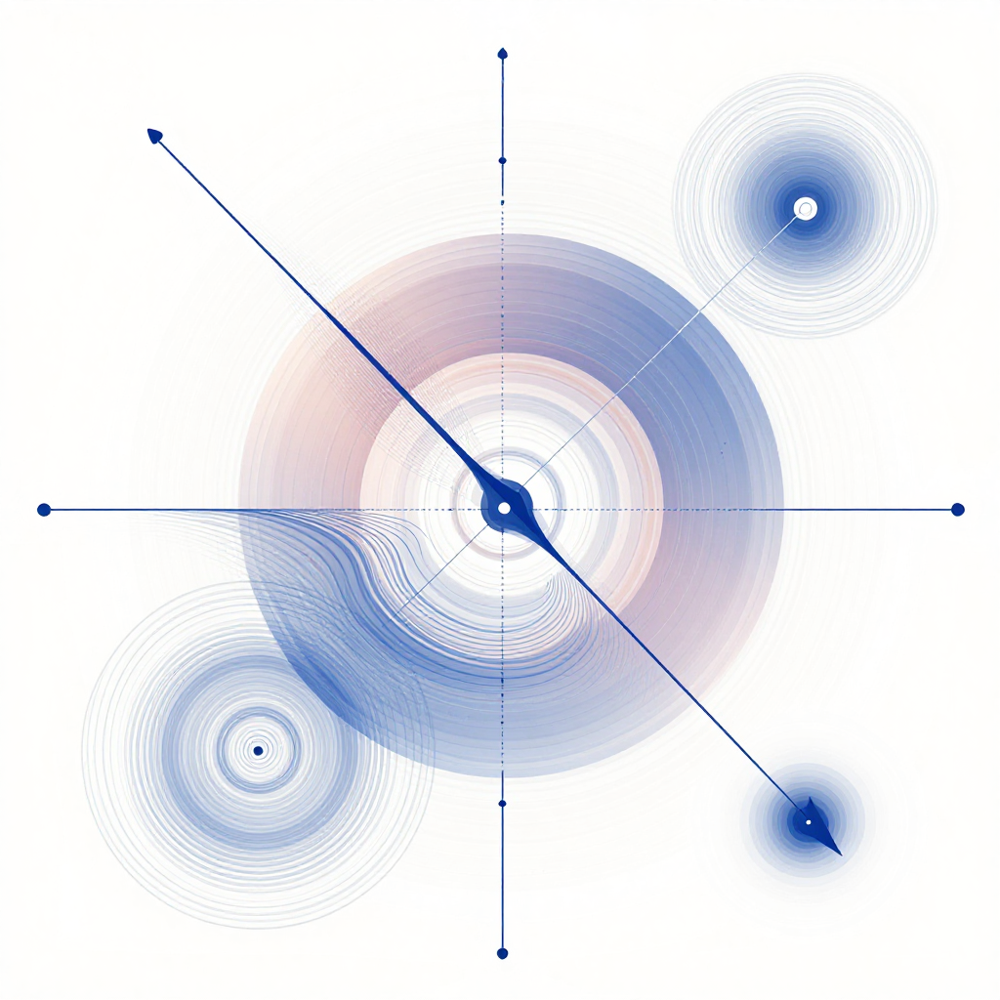
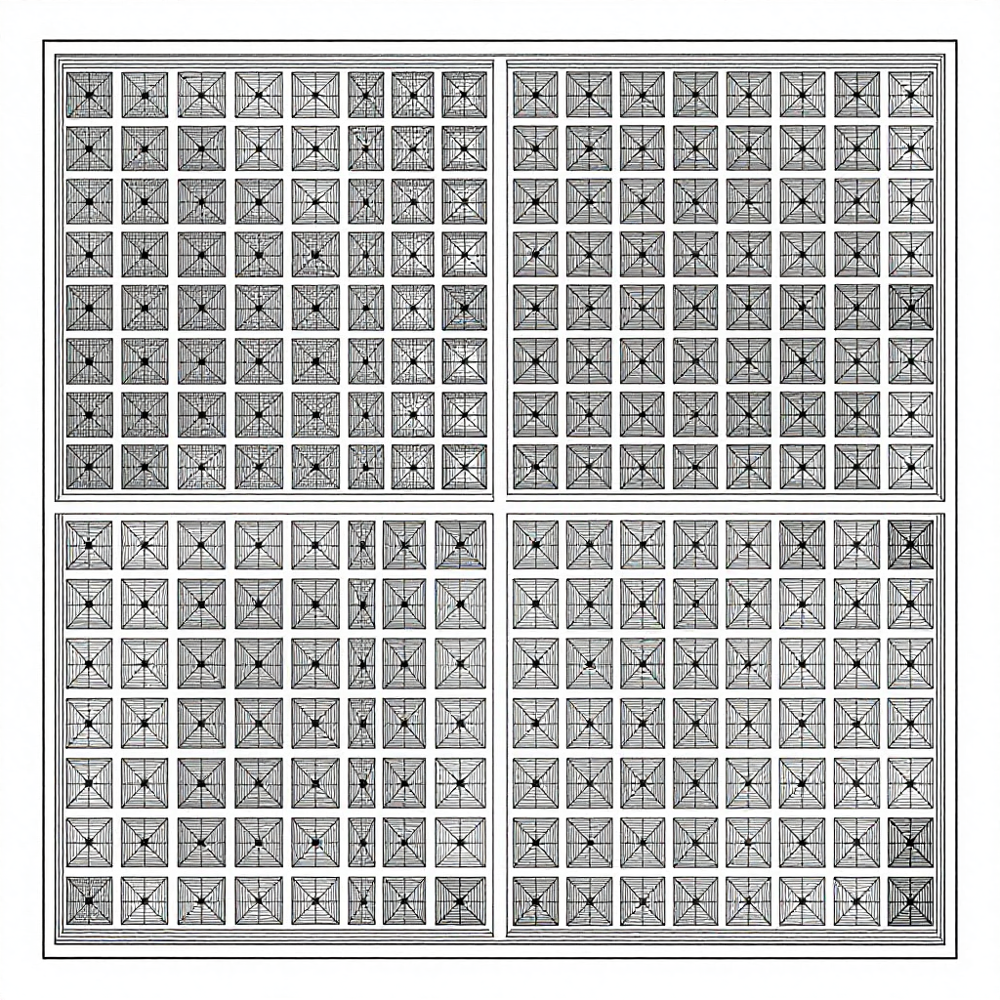
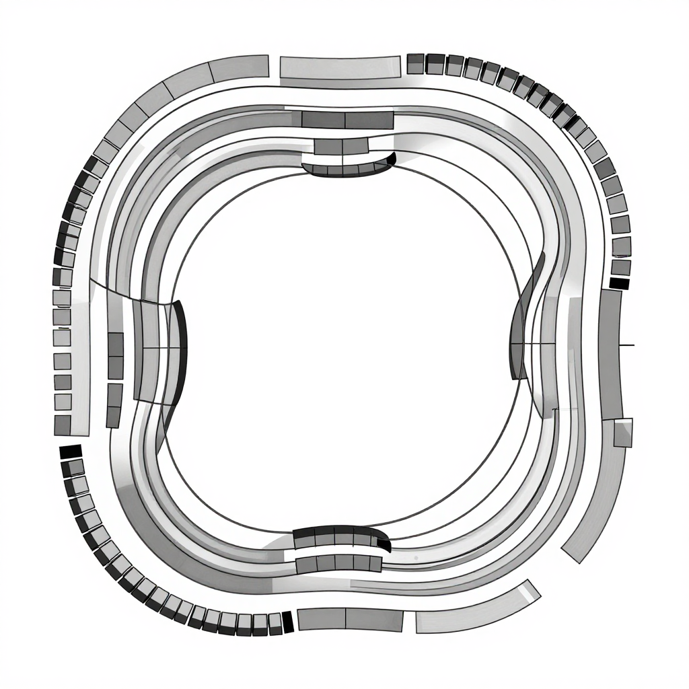
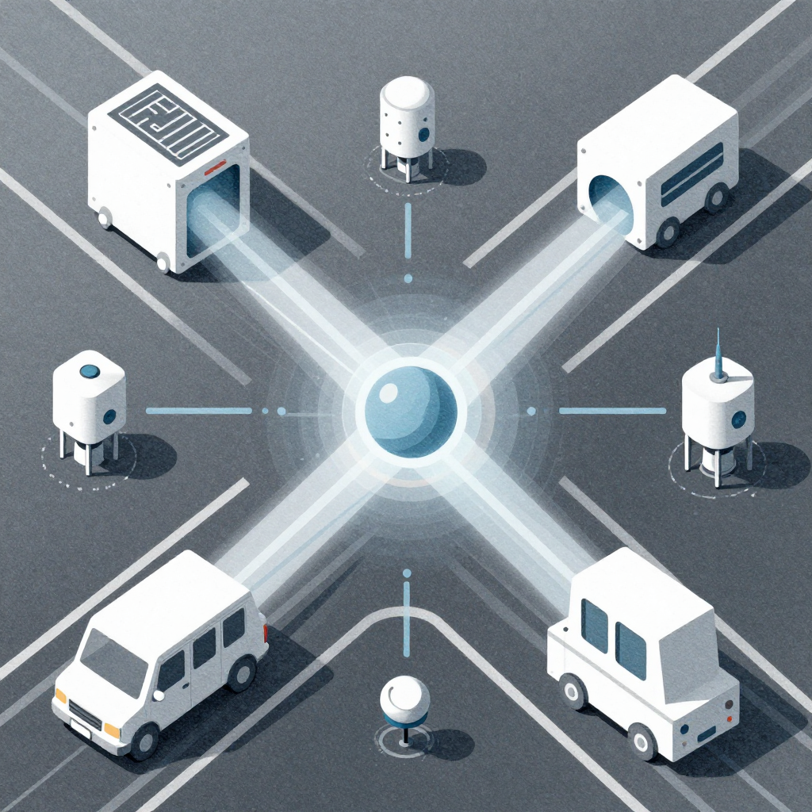
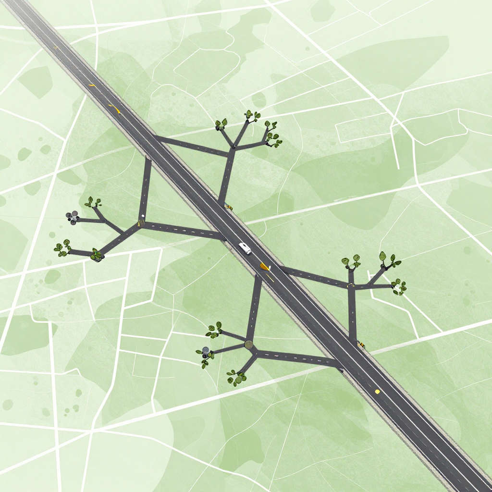
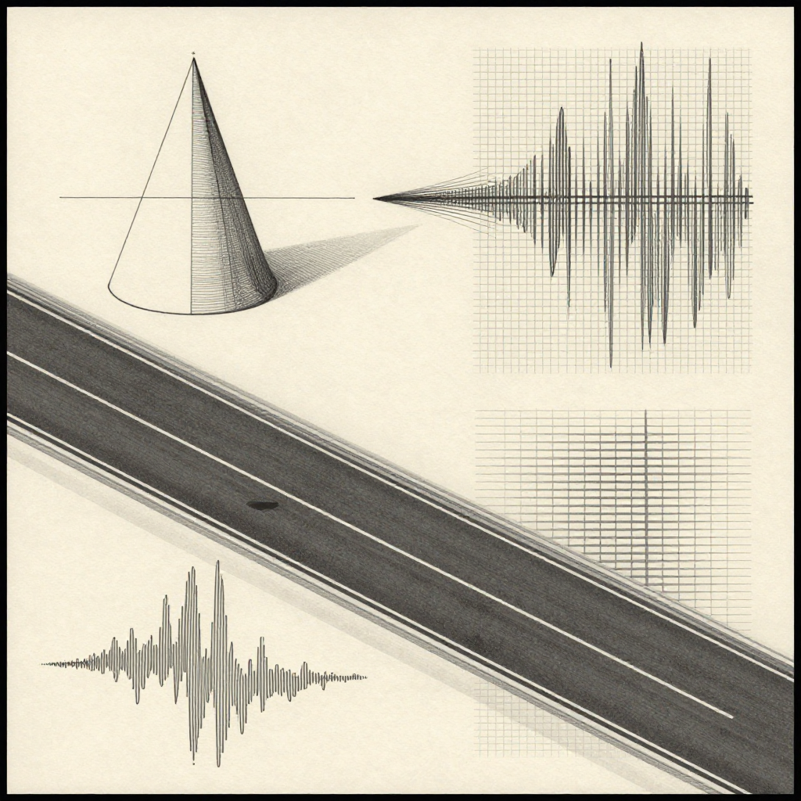
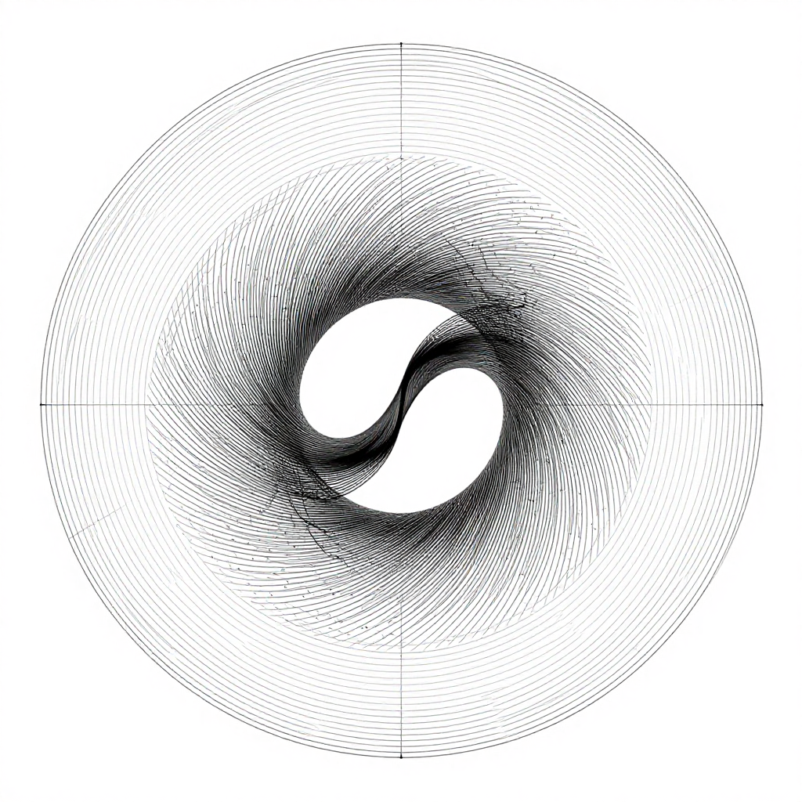

# Images — Scientific–Artistic Illustration Set for LaegnaLaneAI

This folder contains eight scientific–artistic illustrations, one for each major chapter of the **LaegnaLaneAI** document.  
Each image description is structured for Creen AI 2.0 to generate consistent, watermark‑free visuals.  
Each section includes:
- A scientific–artistic **title**
- The **filename** and a **relative link**
- A **copyable include‑line** for the main article (`Images/filename.jpg`)
- A safe **expected image** description
- A **user‑editable** subchapter
- Two **copyable fenced code blocks**:  
  - one with **only the shortform task**  
  - one with **only the longform task**

---

# Image 0 — The Unified Field of Laegna
**File:** `0_The_Unified_Field_of_Laegna.jpg`  
**Local link:** [0_The_Unified_Field_of_Laegna.jpg](0_The_Unified_Field_of_Laegna.jpg)



**Include in main article:**  
``

## Expected Image
A scientific–artistic “integral” illustration representing the entire LaegnaLaneAI document as one coherent field.  
The image should evoke unity: linear axes, exponential flows, angular spirals, multi‑resolution layers, and faint symbolic hints of perception, geometry, and infinity.  
It should feel like a conceptual map of the whole system — not literal, not diagrammatic, but a single artistic field where all motifs coexist harmoniously.

No text, no formulas, no watermarks.

## User‑Editable Details
- Overall mood (calm, energetic, cosmic, geometric)  
- Dominant shapes (spirals, branches, grids, flows)  
- Color palette (monochrome, spectral, warm, cold)  
- Density (minimalistic vs richly layered)  
- Symmetry (radial, axial, or asymmetric)

### Shortform Task
```
Create a unified scientific–artistic illustration representing the entire LaegnaLaneAI system as one coherent field of linear, exponential, angular, and multi‑resolution structures.
```

### Longform Task
```
Generate a scientific–artistic “integral” illustration that symbolizes the whole LaegnaLaneAI document. Combine linear axes, exponential flows, angular spirals, and multi‑resolution layers into a single coherent field. The image should feel like a conceptual map of the system: expressive, structured, and harmonious. Use smooth geometry, layered gradients, and subtle symbolic hints of perception, geometry, and infinity. Avoid text, formulas, and watermarks.
```

---

# Image 1 — Linear Seeds, Exponential Branches
**File:** `1_Linear_Seeds_Exponential_Branches.jpg`  
**Local link:** [1_Linear_Seeds_Exponential_Branches.jpg](1_Linear_Seeds_Exponential_Branches.jpg)


**Include in main article:**  
``

## Expected Image
A scientific–artistic visualization of a straight lane or axis with small linear “seed” points that expand into branching exponential curves. No text, no formulas, no watermarks.

## User‑Editable Details
- Color palette  
- Abstraction level  
- Style (vector, painterly, gradient)  
- Background tone  
- Motion impression  

### Shortform Task
```
Create an artistic scientific illustration showing linear seeds expanding into exponential branches along a central lane axis.
```

### Longform Task
```
Generate a scientific–artistic illustration representing the transformation from linear indices into exponential structures. Show a central lane or axis with small seed points that grow into branching exponential curves. Use smooth geometry, soft gradients, and a balanced composition. Avoid text and watermarks.
```

---

# Image 2 — Mind of the Machine
**File:** `2_Mind_of_the_Machine.jpg`  
**Local link:** [2_Mind_of_the_Machine.jpg](2_Mind_of_the_Machine.jpg)


**Include in main article:**  
``

## Expected Image
An abstract scientific depiction of an AI “perceiving” structured patterns: neural‑like flows, geometric motifs, and faint lane‑like structures emerging from noise.

## User‑Editable Details
- Degree of abstraction  
- Neural vs geometric emphasis  
- Color temperature  
- Density of visual “thought patterns”  

### Shortform Task
```
Illustrate an AI mind discovering structure: abstract flows resolving into geometric lane‑like patterns.
```

### Longform Task
```
Create a scientific–artistic visualization of an AI perceiving structured patterns. Show abstract neural flows gradually forming geometric motifs reminiscent of lane structures. Use soft gradients, layered transparency, and a sense of emerging order. No text or symbols.
```

---

# Image 3 — Skeleton of the Database
**File:** `3_Skeleton_of_the_Database.jpg`  
**Local link:** [3_Skeleton_of_the_Database.jpg](3_Skeleton_of_the_Database.jpg)



**Include in main article:**  
``

## Expected Image
A clean geometric composition showing a “skeleton” of repeated patterns: paired coordinates, branching structures, and layered grids suggesting the disciplined structure of the lane database.

## User‑Editable Details
- Grid density  
- Symmetry level  
- Organic vs mechanical feel  

### Shortform Task
```
Depict the structural skeleton of a patterned database using geometric repetition and layered grids.
```

### Longform Task
```
Generate an artistic scientific image showing the internal skeleton of a structured database. Use repeated geometric motifs, paired elements, and layered grids to evoke disciplined structure. Avoid literal numbers or text.
```

---

# Image 4 — Algebra of the Chains
**File:** `4_Algebra_of_the_Chains.jpg`  
**Local link:** [4_Algebra_of_the_Chains.jpg](4_Algebra_of_the_Chains.jpg)



**Include in main article:**  
``

## Expected Image
An artistic representation of mathematical chains: layered exponential curves, interlocking segments, and a sense of compositional rules forming a coherent whole.

## User‑Editable Details
- Curve complexity  
- Degree of layering  
- Color transitions  

### Shortform Task
```
Illustrate interlocking exponential chains forming a coherent algebraic structure.
```

### Longform Task
```
Create a scientific–artistic visualization of exponential chains combining into a structured whole. Use layered curves, interlocking segments, and smooth transitions to evoke algebraic composition. No text or formulas.
```

---

# Image 5 — Machines on the Road
**File:** `5_Machines_on_the_Road.jpg`  
**Local link:** [5_Machines_on_the_Road.jpg](5_Machines_on_the_Road.jpg)



**Include in main article:**  
``

## Expected Image
A conceptual scene where abstract machines or sensors interact with lane‑like structures. Not literal cars — more symbolic: geometric devices, sensing rays, or abstract agents reading lane geometry.

## User‑Editable Details
- Level of abstraction  
- Presence of symbolic sensors  
- Motion or stillness  

### Shortform Task
```
Show abstract machines interacting with lane‑like structures in a symbolic, scientific style.
```

### Longform Task
```
Generate an artistic scientific illustration of abstract machines or sensing agents interacting with lane‑like geometry. Use symbolic shapes, rays, or fields to represent perception and control. Avoid literal vehicles or text.
```

---

# Image 6 — Horizon of the Ecosystem
**File:** `6_Horizon_of_the_Ecosystem.jpg`  
**Local link:** [6_Horizon_of_the_Ecosystem.jpg](6_Horizon_of_the_Ecosystem.jpg)



**Include in main article:**  
``

## Expected Image
A wide, layered composition suggesting a roadmap or horizon: branching structures, multi‑resolution layers, and a sense of forward expansion into a larger ecosystem.

## User‑Editable Details
- Horizon shape  
- Depth layers  
- Color gradient  

### Shortform Task
```
Depict a scientific–artistic horizon representing the growth of a lane ecosystem.
```

### Longform Task
```
Create a wide, layered illustration symbolizing the expansion of a lane ecosystem. Use branching structures, multi‑resolution layers, and a sense of forward motion. Avoid text and literal maps.
```

---

# Image 7 — Echoes of Classical Geometry
**File:** `7_Echoes_of_Classical_Geometry.jpg`  
**Local link:** [7_Echoes_of_Classical_Geometry.jpg](7_Echoes_of_Classical_Geometry.jpg)



**Include in main article:**  
``

## Expected Image
A fusion of classical geometric motifs — conics, grids, waveforms — blending into lane‑like structures. The image should feel like mathematics echoing into modern form.

## User‑Editable Details
- Classical vs modern balance  
- Grid curvature  
- Waveform prominence  

### Shortform Task
```
Blend classical geometric motifs with lane‑like structures in an artistic scientific style.
```

### Longform Task
```
Generate an illustration merging classical geometry (conics, grids, waveforms) with modern lane‑like structures. Use smooth transitions and layered motifs to evoke continuity between traditions. No text.
```

---

# Image 8 — The Angular Infinity
**File:** `8_The_Angular_Infinity.jpg`  
**Local link:** [8_The_Angular_Infinity.jpg](8_The_Angular_Infinity.jpg)



**Include in main article:**  
``

## Expected Image
A scientific–artistic depiction of angular infinity: a circular or spiral structure with exponential outward collapse and stable angular density.

## User‑Editable Details
- Spiral vs circular emphasis  
- Angular density  
- Color field  

### Shortform Task
```
Illustrate angular infinity using circular or spiral structures with exponential collapse.
```

### Longform Task
```
Create a scientific–artistic visualization of angular infinity. Use circular or spiral geometry where outward regions collapse exponentially while angular density remains stable. Evoke the lin‑exp circle and angle‑centric infinity. Avoid text or formulas.
```
