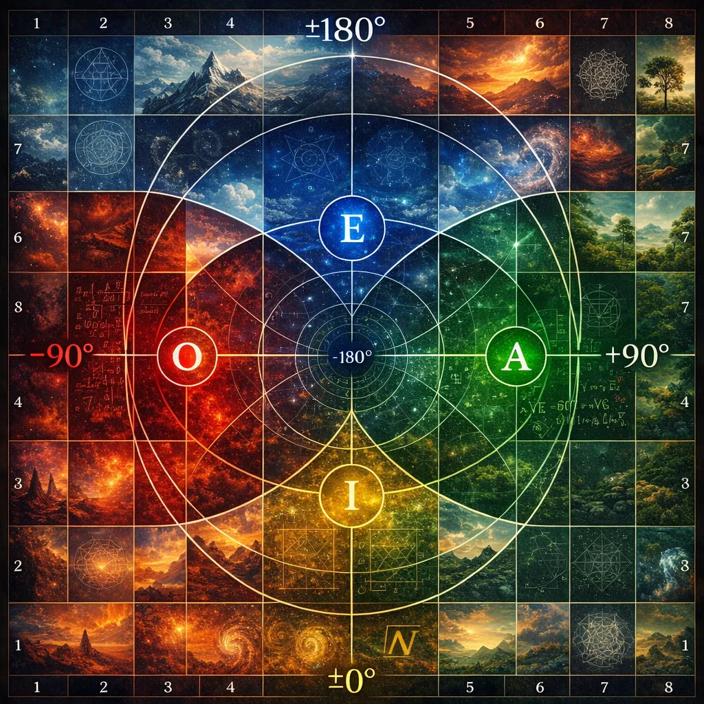

Typically, number systems are imagined in the following geometry, which can be used to construct Lanes:

# Diagonal IOAE

In diagonal view:
- Each letter associates strictly with zone up (larger), down (smaller), left (smaller), right (larger).

Where I and E are basically exponents (log=>exp zone):

# Parallel IOAE

