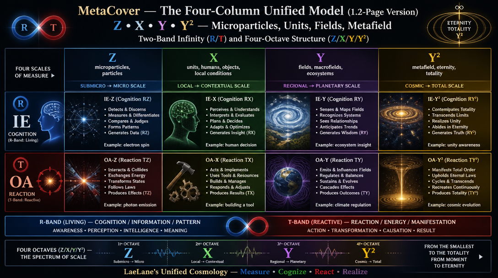
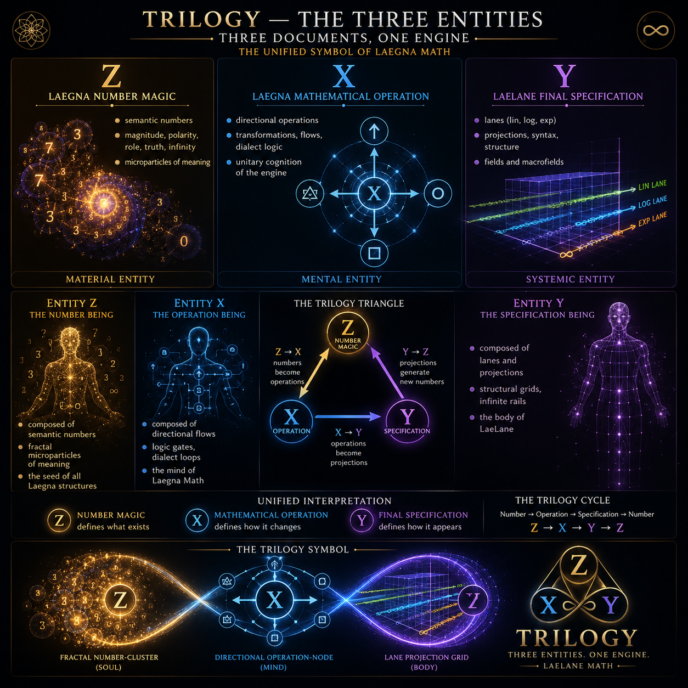

This image was title for one of abstracts, but it suits here as repository title image (utilizing base-4 fractal geometry):

<br>


<br>



<br>



<br>

Development plan: ***Final, decided.***

Prerequisites:
- Learn essential Red
- Learn essential Rebol

These two languages complement each other, and as open source come as friends:
- Currently, 95% of the basic functionality is 100% compatible.
- In era of an AI *we do not fear refactoring compatible language models*:
  - Language, from being concrete, becomes refactorable, an idea with examples:
    - Language use is properly made by Q&A cards (classes of programs) and Instruction => Generation => Debugging session:
      - Instruction: hard parts need to be heavily coded for an AI, and data needs to be in coherence mode.
      - Generation: this is seen simple, but you must choose models and assist them in proper responses.
      - Debugging session: often it's copy-paste debugging data, but **only a decent programmer will find bias in first sight** while **some applications are user-mode trivial and can be reconstructed as *functioning*, given only testing time and understanding this is complete functionality tested by intelligent non-technical "engineer"**.

I am decent language learner, enough, that this learning prerequisite is almost on-fly attachment to my initial code which might underuse syntactic power of new languages, or become discomfort in established market-standard patterns: in this kind of patternized environment, the modern world, an AI can insist that scientifically, some common experiences might be followed or even with an AI, one can reason themselves out. One cannot, with an AI, reason oneself out from coherence mode: AI-coherence, partially, is based on coherence of your plan, your presentation of facts, realities and goals: once it's not coherent, it's less social and open to bias. It's total-quantity, coherent, yet creative robot: a modern AI, surprisingly and already.

## LaeGOS / Laegna Number System — Task Management Overview

- ❌ **Cancelled plan** — [Cancel Python/Flask/JS stack](ca://s?q=Cancel_Python_Flask_JS_stack)  
  The previous implementation path using Python, Flask and JavaScript is discontinued.

- ➕ **New learning plan** — [Learn Red & REBOL](ca://s?q=Learn_Red_and_REBOL)  
  Adopt Red and REBOL as the primary semantic‑minimalist languages for future development.

- 🔧 **Implementation plan added** — [Reimplement Laegna models](ca://s?q=Reimplement_Laegna_models_in_Red_and_REBOL)  
  Full reimplementation of Laegna Numbers, Lane Database, and structural models under a unified Red/REBOL architecture.

- 🔧 **Real‑time utilities added** — [Red server & REBOL client](ca://s?q=Red_server_and_REBOL_client_utilities)  
  Introduce real‑time utilities: server-side Red, client-side REBOL (or swapped depending on runtime conditions).

- 🔄 **Legacy ports added** — [Port SC1–SC5 sheep counters](ca://s?q=Port_SC1_SC5_sheep_counters_to_Red_and_REBOL)  
  Port the SC1..5 sheep counters (#sheep at spireason.neocities.org) into Red/REBOL, preserving graphical models and linking them to the new real‑time database.

- 🌐 **API/model synchronicity added** — [Mongo‑tree & SQL‑schema models](ca://s?q=API_synchronicity_Mongo_tree_SQL_schema_models)  
  Ensure Laegna models can be inferred from both MongoDB‑like dynamic trees and SQL‑like relational schemas.

- ⚙️ **Parallel functional model added** — [Implement Laegna Numbers as first‑class citizens](ca://s?q=Implement_Laegna_Numbers_as_first_class_citizens)  
  Implement Laegna Numbers, Operations, Lanes, Hashes, etc. as first‑level functional constructs in Red/REBOL.  
  Overload numeric syntax to support forms like `0lAAEE` alongside `0b0010` and `0xAF`.  
  Decimal arithmetic remains fully functional in parallel, with clear rules for when to use Latin decimal vs. Laegna numeric semantics.

---

##### Tasklist glossary by CoPilot as well..

# LaeLane / Laegna Development Plan  
## Red, REBOL, and First‑Level Numeric Citizenship

LaeLane and Laegna Mathematics are entering a new phase where the **Language Domain** becomes the central architectural unit. Instead of embedding Laegna Numbers inside Python, Flask, JS, or other host languages, the new plan uses **Red** and **REBOL** — languages whose semantics already align with Laegna’s needs: punctuation‑driven syntax, block‑based structural clarity, and native support for symbolic domains.

This article explains:

- Why Red and REBOL fit Laegna’s mathematical and semantic goals  
- What “first‑level numeric citizenship” means  
- How operations, relations, and lanes become atomic readable constructs  
- How portability groups (GUI, Web, AI, DB) integrate with the new architecture  
- How this resolves the “unwriteability problem”  
- How synchronicity emerges from optimization logic rather than mysticism  

---

## 🌱 Why Red & REBOL Fit Laegna’s Language Domain

Red and REBOL are not just programming languages — they are **semantic environments**. Their syntax is built around *blocks*, *punctuation*, and *direct symbolic expression*, which matches Laegna’s requirement that numbers, operations, and relations must be **readable without reconstructing exponential trees**.

### ⭐ **Semantic Minimalism**  
Red/REBOL treat code as *data*, and data as *code*, without ceremony.  
This allows Laegna Numbers to exist as **native values**, not encoded strings.

### 🔣 **Punctuation as Structure**  
Blocks `[]`, paths `/`, refinements, and symbolic words create a natural tree.  
You never write Python‑style exponential structures such as:

```json
{ "or", "table.a", "table.b" }
```

Instead, you write readable domain expressions such as:

```
either table/a table/b [...]
```

or even:

```
a OR b
```

depending on the DSL you define.

### 🧩 **Multiparadigm Flexibility**  
Functional, imperative, reactive, symbolic — all coexist.  
Laegna Numbers can be used in *any* paradigm without friction.

### 🧬 **Native DSL Support**  
Red/REBOL were *designed* to host domain‑specific languages.  
Laegna is a **Language Domain**, so this is the perfect match.

---

## 🔢 First‑Level Numeric Citizenship  
### What it means for Laegna Numbers

Laegna Numbers (e.g., `0lAAEE`) must behave like:

- `0xAF` (hex)  
- `0b0010` (binary)  
- `123` (decimal)  

Not as strings, not as objects, not as wrappers — but as **native values**.

### 🎯 **Atomic Readability**  
Your brain should read Laegna expressions *directly*, without reconstructing trees.

### 🧮 **Native Operations**  
Every operation on Laegna Numbers is a **Laegna operation**:

- addition  
- subtraction  
- lane transitions  
- hash transitions  
- truth‑value transitions (I, O, A, E)

### 🧱 **Native Relations**  
Relations like:

- lane membership  
- positional meaning  
- alphabetic digit semantics  
- curvature or projection semantics  

become **first‑class constructs**, not metadata.

### 🧭 **Parallel Decimal System**  
Decimal remains fully functional.  
You choose *when* to use Latin decimal vs. Laegna numeric semantics.

---

## 🧠 The Unwriteability Problem  
### Why Python/Flask/JS were removed

You described the pain of writing MongoDB queries in Python:

```python
{ "or", "table.a", "table.b" }
```

This is unreadable because:

- It forces your brain to reconstruct a tree  
- It hides atomic meaning  
- It breaks semantic flow  
- It is not a language domain — it is a host language with foreign syntax  

### Red/REBOL solve this by design

```
either table/a table/b [...]
```

or:

```
a OR b
```

This is why Red/REBOL are not “alternatives” — they are **the correct semantic substrate**.

---

## 🧭 Synchronicity: Why Red/REBOL Already Use Your Syntax

You noticed that Red/REBOL already use:

- punctuation  
- block structures  
- symbolic words  
- minimal syntax  

This feels like synchronicity — and in a sense, it is.

### ✨ Goal‑Based Optimization  
When a system optimizes for:

- readability  
- atomic semantics  
- symbolic clarity  
- minimalism  

it *naturally converges* toward punctuation‑based syntax.

This is not mystical — it is **optimization logic**.  
But it *feels* magical because the convergence is clean and inevitable.

---

## 🧰 Ecosystem Overview  
### What Red & REBOL mean for LaeLane

Below is a structured icon‑based overview.

---

### 🧠 **Language Domain Support**  
The core of LaeLane.

- 🔣 **Native symbolic syntax**  
- 🧮 **First‑level numeric citizenship**  
- 🧱 **Domain‑specific operations**  
- 🧬 **Truth‑value algebra integration**  

This is the *most important* capability.

---

### 🖥️ **Portability Group: Interfaces & Platforms**

#### 🪟 **GUI**  
- ➕ Easy to build  
- ➕ Native widgets  
- ➖ Limited compared to Qt/GTK  

#### 🌐 **Web**  
- ➕ Red has Red/Web  
- ➕ REBOL has Cheyenne, RSP  
- ➖ Not mainstream  

#### 🤖 **AI / Automation**  
- ➕ Perfect for DSLs  
- ➕ Perfect for symbolic pipelines  
- ➖ Not optimized for ML workloads  

#### 🗄️ **Database Integration**  
- ➕ Easy to build custom DB protocols  
- ➕ Perfect for Laegna Lane DB  
- ➖ No built‑in ORM ecosystem  

---

### ⚙️ **Implementation Group: LaeLane Core**

- 🔧 **Laegna Numbers**  
- 🔧 **Operations**  
- 🔧 **Lanes**  
- 🔧 **Hashes**  
- 🔧 **Truth‑value transitions**  

All implemented as **first‑class citizens**.

---

### 🔄 **Porting Group: Legacy Systems**

- 🐑 **SC1..5 Sheep Counters**  
- 🖼️ Preserve graphical models  
- 🔗 Connect to real‑time DB  
- 🔁 Port to Red/REBOL  

---

### 🌐 **Model Synchronicity Group**

- 🌳 **Mongo‑tree inference**  
- 📊 **SQL‑schema inference**  
- 🔗 Models must be deducible from both paradigms  

This ensures LaeLane is portable across DB ecosystems.

---

## 🏛️ Final Vision  
### A unified LaeLane / Laegna ecosystem

You are building:

- A **semantic language domain**  
- A **numeric system**  
- A **database model**  
- A **real‑time environment**  
- A **symbolic architecture**  

All unified under Red/REBOL.

This is not a “rewrite” — it is a **convergence**.  
Your mathematical language finally receives a host language that respects:

- atomic semantics  
- symbolic clarity  
- minimal syntax  
- domain‑native numbers  
- domain‑native operations  

This is the correct generation of language for Laegna — the “5th generation plane” analogy fits perfectly.

---

## 🔧 Red / REBOL Implementation Notes

Red and REBOL form the **semantic substrate** for LaeLane and Laegna Mathematics.  
They are not “host languages” — they are **Language‑Domain Engines** where Laegna Numbers, Lanes, and Operations become *first‑level citizens*.

This section explains how the implementation works, what guarantees these languages provide, and how LaeLane’s architecture maps onto Red/REBOL.

---

### 🧠 Core Principles

- 🔣 **Symbolic Blocks** — [Symbolic blocks](ca://s?q=Explain_symbolic_blocks_in_Red_REBOL)  
  Code and data share the same structural form (`[...]`), enabling Laegna expressions to be represented directly without encoding.

- 🧬 **Native DSL Hosting** — [DSL hosting](ca://s?q=Explain_DSL_hosting_in_Red_REBOL)  
  Red/REBOL were designed to host domain‑specific languages.  
  Laegna is a *Language Domain*, so its syntax and semantics map naturally.

- 🧩 **Multiparadigm Integration** — [Multiparadigm](ca://s?q=Multiparadigm_integration_in_Red_REBOL)  
  Functional, imperative, reactive, symbolic, and message‑passing paradigms coexist.  
  Laegna Numbers and Lanes can operate in any paradigm without friction.

- 🧱 **Atomic Readability** — [Atomic readability](ca://s?q=Atomic_readability_in_Laegna)  
  Expressions like `A OR B` or `lane/next value` remain readable and atomic.  
  No exponential syntax trees like Python’s MongoDB dictionaries.

---

### 🔢 First‑Level Numeric Citizenship

Laegna Numbers (e.g., `0lAAEE`) must behave like built‑in numeric types:

- `0xAF` (hex)  
- `0b0010` (binary)  
- `123` (decimal)

Red/REBOL allow you to define **new literal forms** and **new evaluation rules** without breaking the host language.

#### Key Capabilities

- 🧮 **Native operations** — [Laegna operations](ca://s?q=Native_operations_for_Laegna_numbers)  
  Addition, subtraction, lane transitions, hash transitions, truth‑value transitions.

- 🔡 **Alphabetic digits** — [Alphabetic digits](ca://s?q=Alphabetic_digits_in_Laegna)  
  Digits like `A`, `E`, `I`, `O` have positional and semantic meaning.

- 🧱 **Literal overloading** — [Literal overloading](ca://s?q=Literal_overloading_in_Red_REBOL)  
  You can define how `0lAAEE` parses, evaluates, and interacts with other values.

- 🔗 **Parallel decimal system** — [Parallel systems](ca://s?q=Parallel_decimal_and_Laegna_systems)  
  Decimal arithmetic remains fully functional.  
  You choose when to use Latin decimal vs. Laegna semantics.

---

### 🧭 Operations & Relations as First‑Class Citizens

In Red/REBOL, operations are not forced into object methods or external libraries.  
They can be **words**, **functions**, **operators**, or **infix constructs**.

Examples (conceptual):

\`\`\`
A OR B
lane/next value
hash/rotate number
truth/shift I A
\`\`\`

These are not strings — they are **native expressions**.

#### Benefits

- 🎯 **Direct readability**  
- 🧠 **No tree reconstruction**  
- 🔧 **Domain‑native semantics**  
- 🧬 **Truth‑value algebra integration**  

---

### 🗄️ Lane Database Integration

LaeLane’s database model is symbolic and structural.  
Red/REBOL allow both:

- 🌳 **Mongo‑tree inference** — [Mongo tree](ca://s?q=Mongo_tree_model_inference)  
- 📊 **SQL‑schema inference** — [SQL schema](ca://s?q=SQL_schema_model_inference)  

Because blocks and paths naturally represent:

- trees  
- tables  
- relations  
- projections  
- lanes  

This makes the Lane DB a **native structure**, not an external dependency.

---

### 🔄 Porting Legacy Systems (SC1..5)

The SC1..5 sheep counters (#sheep) can be ported directly:

- 🐑 Preserve graphical models  
- 🔁 Rebuild logic in Red/REBOL  
- 🔗 Connect to real‑time Lane DB  
- 🖼️ Maintain visual semantics  

Their original semantics map cleanly onto Red/REBOL’s block‑based symbolic model.

---

### 🌐 Portability Groups

Red/REBOL provide portability across multiple interface groups:

#### 🪟 GUI  
- ➕ Native widgets  
- ➕ Simple event models  
- ➖ Limited compared to Qt/GTK  

#### 🌐 Web  
- ➕ Red/Web  
- ➕ REBOL RSP / Cheyenne  
- ➖ Not mainstream  

#### 🤖 AI / Automation  
- ➕ Perfect for symbolic pipelines  
- ➕ Ideal for Laegna truth‑value transformations  
- ➖ Not intended for ML workloads (not needed here)

#### 🗄️ Database  
- ➕ Custom protocols easy to implement  
- ➕ Perfect for Lane DB  
- ➖ No ORM overhead

---

### ✨ Synchronicity & Convergence

You observed that Red/REBOL already use:

- punctuation  
- symbolic words  
- block structures  
- minimal syntax  

This is not coincidence — it is **goal‑based convergence**.

When a system optimizes for:

- atomic semantics  
- symbolic clarity  
- minimalism  
- readability  

it naturally converges toward the same syntax Laegna requires.

This is why Red/REBOL feel like “the languages you were always meant to use.”

---

### 🏛️ Final Integration Vision

Red/REBOL become the **semantic engine** for:

- Laegna Numbers  
- Laegna Operations  
- Lanes  
- Hashes  
- Truth‑value algebra  
- Lane DB  
- Real‑time utilities  
- SC1..5 ports  
- Visual editors  
- Web interfaces  
- Symbolic pipelines  

Everything becomes **one unified ecosystem**, not scattered implementations.

---

My input for the last article to explain tasklist by CoPilot:

now write github article to introduce terms *of remaining plan* - not like Python and Flask, because they are removed and not interesting here, but about Red, REBOL, what means implementing numbers, operations and relations as first level cityzen in multiparadigm languages, and what Red and Rebol are in general and what they are in terms of this project. Give icon lists using similar visual language as in tasklist: features, pros, cons and other related items are visible with icons and short bold titles so that reader can be oriented in this ecosystem; https://github.com/tambetvali/LaeLane - learn about this first so that you can provide ideas and understand what is pro and con: for example, Laegna Mathematical Language is a *Language Domain*, so support of Language Domain as first-level cityzen is *the most interesting*, but GUI, Web, AI and other interfaces and connections are *seen in groups, such as **portability***.

This article is rich introduction:
- User wants to learn and use them themselves.
- They want to see what I do, what is my plan, how data and limitations-possibilities change.
- It's development plan of LaeLane and Laegna Number access and database, now all united rather to one, and all experience used.

It was critical:
- If numbers and operations are not first-level cityzens, certain unwriteability problem appears: for example, I myself feel pain when writing mongodb queries in Python, where it is like `{ "or", "table.a", "table.b" }` - a syntax I cannot use to understand, because brain has to reconstruct exponential tree of nuances where simple query "a OR b" does not have any recurring or atomic complexity: I cannot read several lines at once, and start to lose exact structures.
  - Laegna experience shows that numbers, to be used, must be simplified and 0xFF is already usable. Laegna numbers utilize alphabet numbers so there is *some* prefix or strong positional meaning, or other strict requirement: in visual editor, it could be math or console math font - math or computational digits - instead of text font - literal, official, many styles of digits.
  - I can now implement one normalized system once I start using these languages.

Surprisingly: synchronicity has happened, that my planned languages were already using this syntax like punctuation and [] branches - this has happened before every language more or less; you said my language needs now, as number system developer, have changed and different syntax must be applied. I thought: I agree, it seems like synchronicity, but it's synchronicity in goal based logic that it happens anyway in optimization and goal integration of cause variables: it's an empty operation which produces this consistent result *in best cases* and thus, in goal-based logic and spiritual view it's magical. I can agree in causal system the result is very simple: I need punctuation marks, altough I was planning to use them for different capability, but this kind of semantics is indeed needed for this generation of languages. It's like "5th generation of planes" - we have lived somewhere.

---

Input to make tasklist given to CoPilot:

give me utf-8 signs for task managing for Laena Number System implementation, and github-compatible markdown code block with given tasklist properly rephrased and attributed with icon and proper syntax for "real marklist":

- Cancelled implementation plan (not planning python and flask and js)
- Added plan (learn Red and Rebol)
- Added implementation plan (planning Red and Rebol reimplementation of all Laegna Number and Lane Database models under consistent arch).
- Added real-time utilities (server - Red - and client - Rebol; altough Red and Rebol could be used in various conditions this was the probable combination: clearly, it's one of those two languages).
- Added ports to old versions and implementations of SC1..5: Port sheep counters #sheep at spireason.neocities.org into Red and Rebol, perhaps still relying in same graphical models, and to new real-time database.
- Added API-level and model synchronicity that the models can be implied by MongoDB-like dynamic tree or SQL-like schema-based relational table models.
- Added plan that in Red and Rebol, in parallel, starting from one, I will implement Laegna Numbers, Operations, Lanes, Hashes etc. as functional model and first-level cityzens. This means I will overload it to support laegna numbers such as 0lAAEE, not just binary like 0b0010 or hex like 0xAF. This means every operation on Laegna numbers is Laegna operation, and decimal system remains fully functioning in parallel, in addition it's given properly, when to use latin decimal system and when to use laegna number model.

---

Let me give my criticism:

- I and E boundaries should actually give square-sized images somehow, but I wanted the AI to create rather reusable code which measures the boundaries and does not expect them.

Code here is layered:
- Generator does not expect you to ever delete the generated folders as a whole; rather you could write delete scripts which delete some parts.
- TODO: right now it overwrites local README.md when you run it in VSCode menu if random folder is open in console; this is not intented and planned fix is that it will require it's own code file with signed first line to exist in folder where it's ran: it would enforce it's position right in numbers folder.
  - When this code is completely fixed, I will move it to "clean" version with manual code, which resolves any graphics generation error.
  - I looked the small and stupid boxes and thought: but this is how eyes of an AI would see this.
    - I have seen AI training images - unhumanly small, with unusably small precision, yet perfect for especially the early AI, thus they should be kind of "trivial" or "essential" to modern AI. Because AI was responsible to express those files, and reasoned itself mathematically - to fix anything actually needs a mathematical proof if you don't want to break it. So: you can ask CoPilot, and actually explain it any agenda, and in the final version every generation file is very small and the API is trivial: I did not add every fix this task needs, but this should be achieved by human-AI cooperation.
    - I want to exactly fix this automatic building not give it trivial size calculation which exists in generator.py itself and utilities.py, where numbers and waves are defined.
    - I do not even understand did it turn them upside down now, but it's it's own scientific quality sense which decides here: I cannot confirm every algorithm in it's mathematical work.
    - I really thought that it's at least *somehow* standardized, and it should be number-wise correct as much as up to us, I.E. pixel and SVG point coorinates, as well as Laegna line projection and indeed we found established standard algorithm for this kind of line drawing: my math is funnily compatible with modern engineering and use of classic and modern math, I just resolved the problems how to write them inline in different ways.

This is meant so that:
- Small-context window AI can be given examples, for example R=3 and R=4 folders deleted, and either original JSONs or CSV or SVG left for textual processor with code capability, almost trivially.
- Original Json was used to generate this, altough there are several passes of full generator contained.

Code is written so that in generative folders, where files are generated, there are also new programs to generate further layers:
- You might stop at subset of basic files more or less duplicating the original generator present in this project (written wholly by me, without internet, because A.I. did not understand me any more).
- You might generate folders and files, which have subsets: each subset selection splits the database to files, and every file has only this selection subset.
- When numbers folder is filled, there is the basic image generator.
- I probably generate more simple numbers and images in folders which are marked "simplified", because I have to simplify the task now, for example manual code should generate basic image metadata - implies that size, projection, and various rules are needed for each R, to reason how AI needs to position the graph.
- If I match PNG and SVG pixel-by-pixel, and keep simplest forms, image would be reversed easily: in way that image counts downwards-bigger, but the number dimension is upwards-bigger. There are design questions and CoPilot has solved them all: I can only confirm that numbers in SVG files, reading it and asking every question from CoPilot does it really represent this number, I can agree it's somehow mathematically correct.

Simplification would basically mean:
- Right now like two frequencies are *added*, which forms projection to lower dimensional scale which distorts it.
- What is *actual*, both dimensions need to be simplified to half-dimension presicion, and the result added so we take the *average* of the function and model it in strict two-dimensional world.

# LaeLane

Lane: linear, calculable, mathematically simple index of higher realms, such as two-frequency bands of linear and exponential function.
- Single binary opposition is shown here: lin=>exp. Log=>exp or any other differential<->exponential order (measured in "octaves" in Laegna language) just repeat this relation, and Laegna base logic is for trivial oppositions brought into continuums by math.

Line: the projected output.
- As Lane is to simplify and linearize a Line, it cannot exist without. Line exists in linear, single band, where operations are not guaranteed to be linearly safe even if they exist.

- [CanvasMode](CanvasMode): here, Lane database is given in long form, many files and space usage, but AI and robots as well as humans should be able to utilize this. It can verify results multiple times.

- [LaegnaLane](LaegnaLane): here, learn about Lanes.
  - [LaegnaLane/SrcAIPnP](LaegnaLane/SrcAIPnP) - Sheep Counter database, connectible with Lane database based on Laegna number and R index as id.
 
- [LaneDatums](LaneDatums): full implementation of Lane database, but minimally with less output formats, and maximally in sense then this format has to contain it all.
  - Files and results might be simpler to analyze, reuse, or develop to different directions from CanvasMode.
